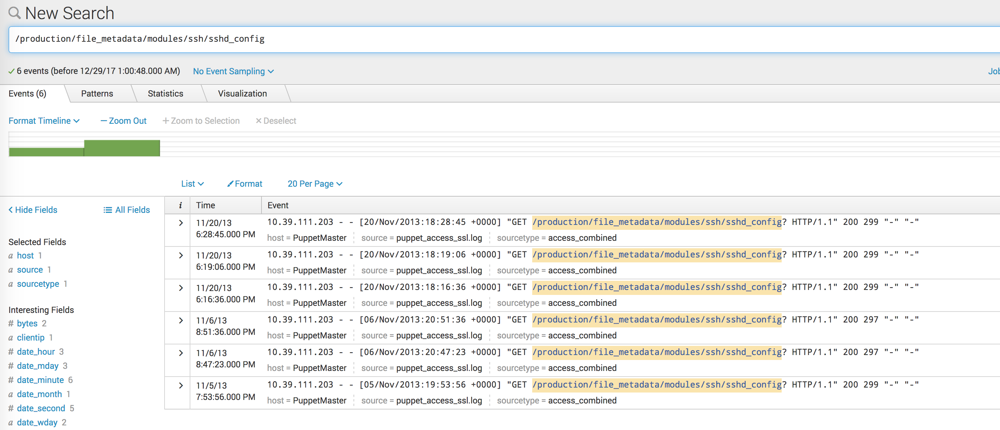
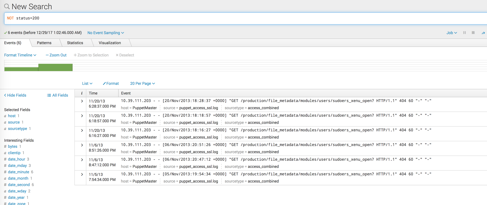
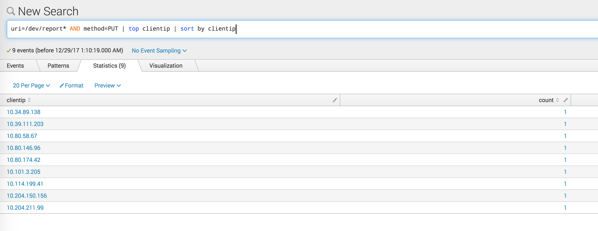

Using Splunk to parse log data
===============

This environment was built in AWS in us-west2 using ami-5b6ca523 on a t2.small.  I did not bother with a dedicated VPC environment, I simply built it in the existing (yet empty) tools VPC.  

Once the instance was started, connect to instance PublicDnsName:8000.  Login is admin/<instance id> .  Use the interface to upload the data file.  It is recognized immediately as an access log.

Analysis:

* one.png shows a simple count of records matching the described URL
Simple Search:
Much like ELK, this is just searching for the string occurance.

	/production/file_metadata/modules/ssh/sshd_config

* two.png shows the same search, exlcuding 200 status.
Simple Search:
A simple string search with the addition of specifiying that the HTTP *status* field should not be 200.

	/production/file_metadata/modules/ssh/sshd_config AND NOT status=200

* three.png shows all entries that are not a status of 200.
Simple Search:
By removing the string search, we include all records where the HTTP *status* field is not 200.

	NOT status=200

* four.png shows the count of returned records for /dev/report/* URI strings with PUT requests, plus the breakdown by client address, sorted.
Simple Search:
Here we use a glob style wildcard in the *uri* field and specify a value of PUT for the *method* field, then sorted into a top ten values for the *clientip* field (easy way to get the counts associated with the address) and then sorted by *clientip*.  The default would be to sort by occurances.

	uri=/dev/report* AND method=PUT | top clientip | sort by clientip

